# Wortal

`Wortal` is a project of a web application accessible via a web browser that provides the platform for organizing sport meetings or events such as sparring games, football matches or training sessions. The main purpose of the application is to facilitate the process of arranging a meeting, allowing users to effectively select a group of players and an optimal place and time for the game. The website is available for amateur football teams searching for opponents and for individuals seeking to join a game for recreation. The key element of the application is creating a sport meeting in a way that is optimal for all participants. 
<br><br>

Welcome screen:
---

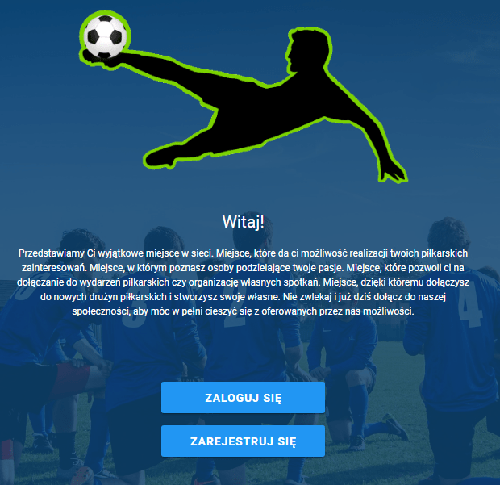
<br><br>

# Running the App

- download the source code from `Github` repository,

- In the root folder of the backend application -> `/Wortal/service`

run:

```bash
$ mvn package -DskipTests
```

- In order to create and run docker containers containing `database`, `Spring Boot` backend app and `Vue.js` frontend app, run following command in the root directory of the project (`/Wortal`):

```bash
$ docker compose up
```
Note: `maven`, `docker` and `docker compose` must be installed and the `docker daemon` must be running.
<br><br>

`docker-compose` and `docker containers` workflow chart:

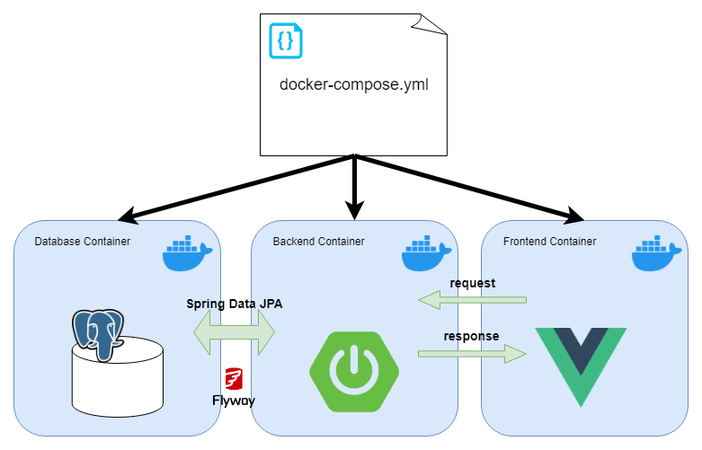
<br><br>

# ER Diagrams

## Conceptual ER diagram:

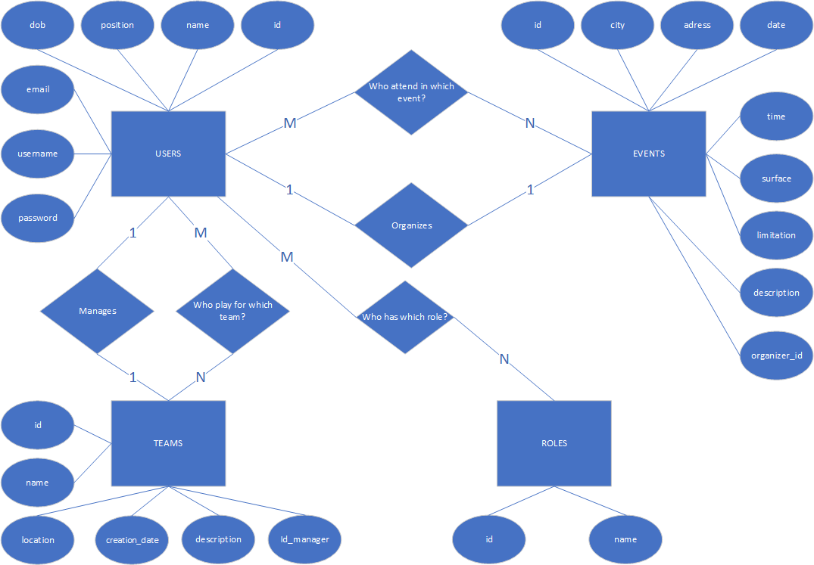

## Physical ER diagram:

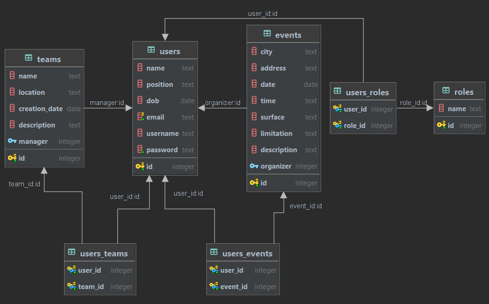
<br><br>

# Interface & Features

## sign in & sign up

Authentication & Authorization was implemented with a use of `Spring Security` and `JWT`.

`JWT` authentication and authorization flow chart:

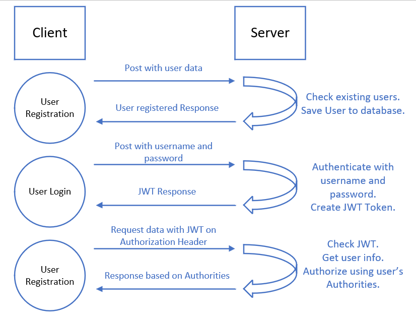

sign in screen:
---
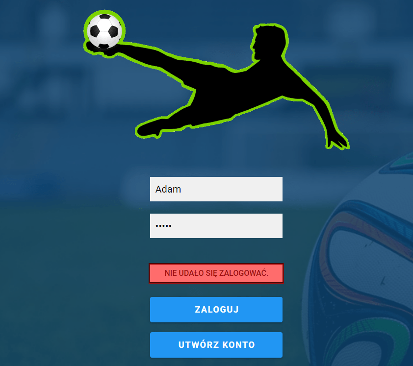

sign up screen:
---
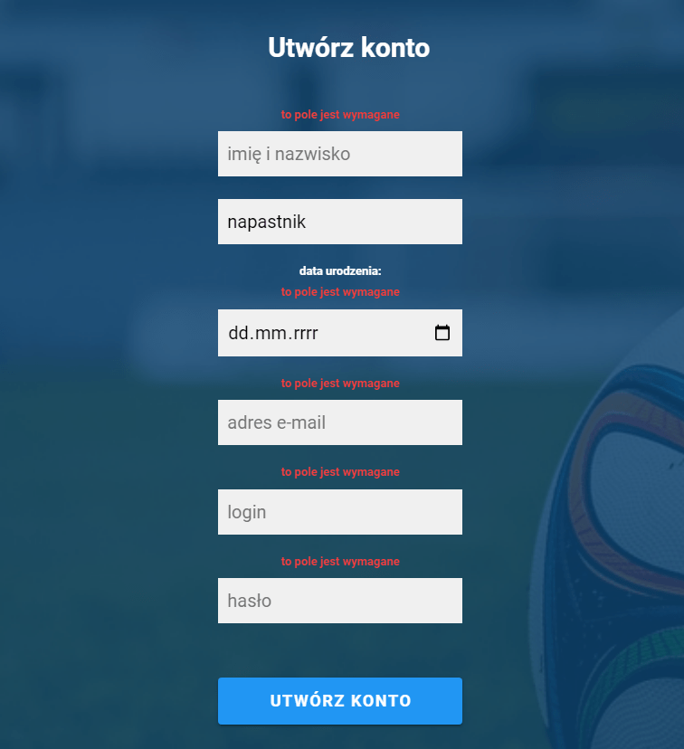
<br><br>

# Events - main views & features

Events Overview screen:
---
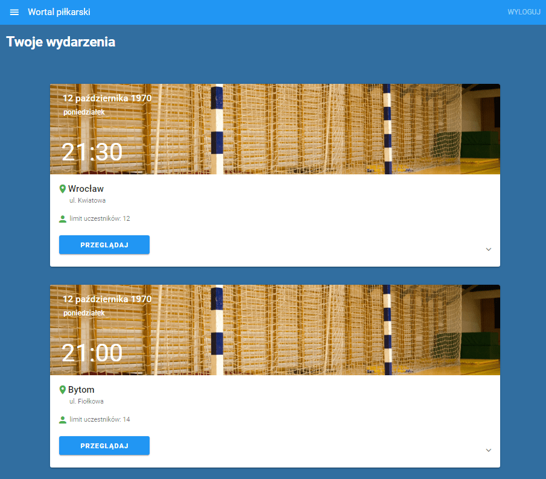

Event Details screen:
---
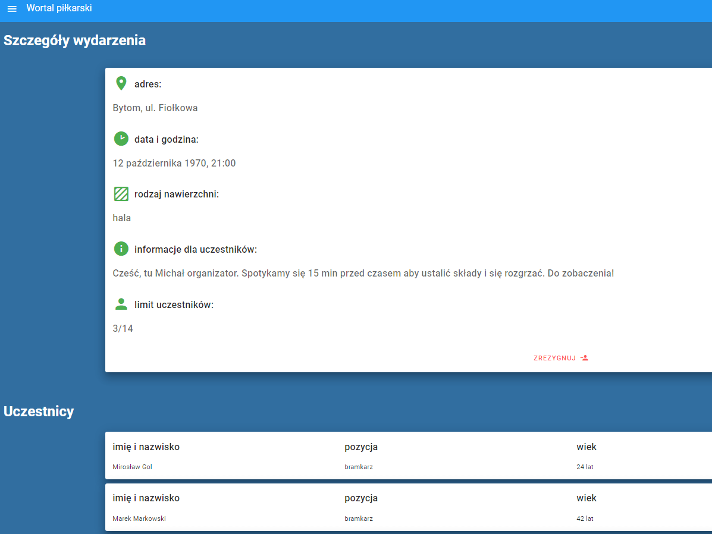

Create Event screen:
---
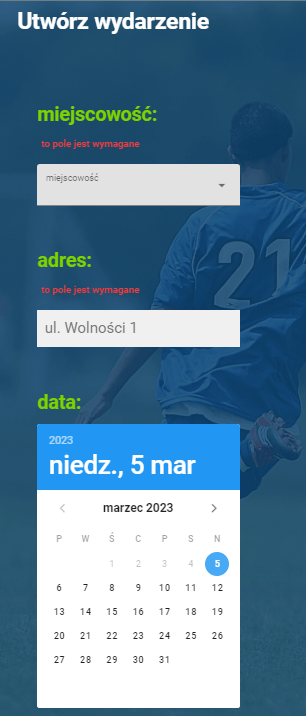

Create Event screen - adding participants:
---
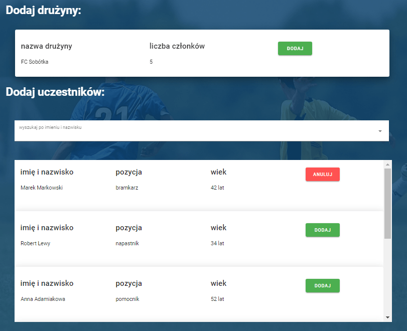
<br><br>
# Teams - main views & features

Create Team screen:
---
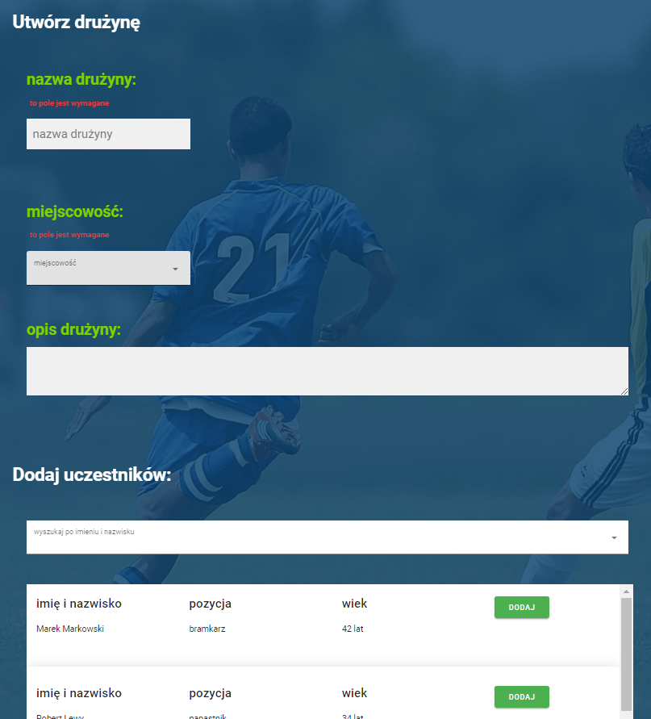

Teams Overview screen:
---
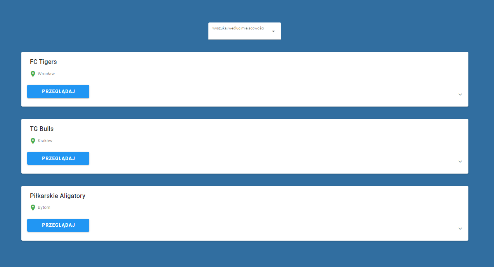

Team Details screen:
---
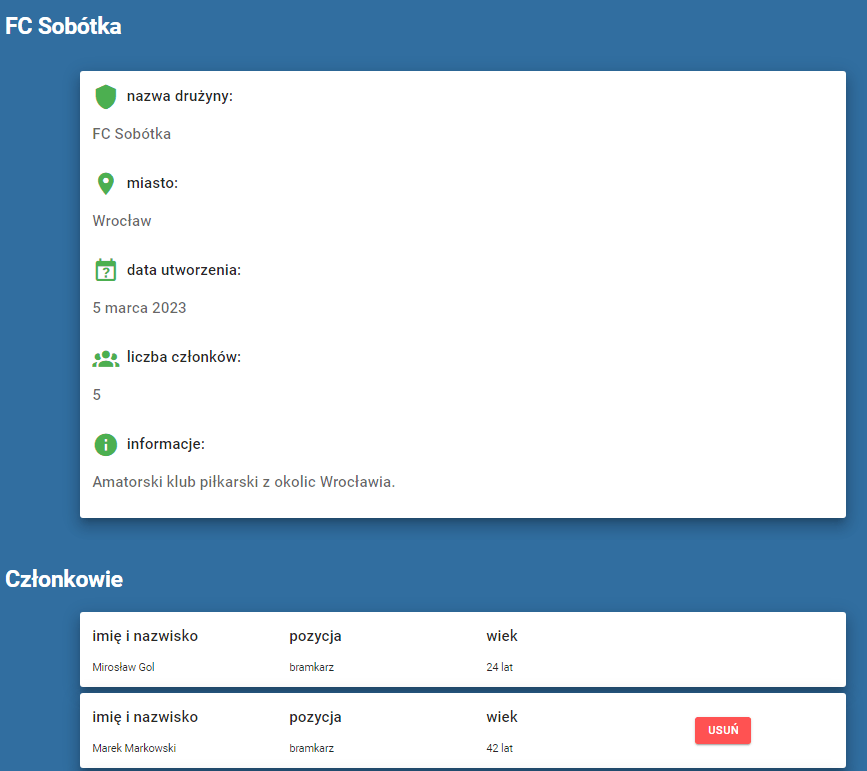
<br><br>

## User Profile

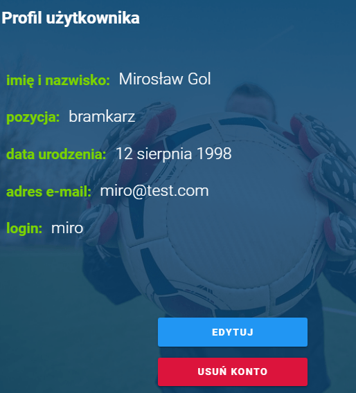
<br><br>

## Administrator panel

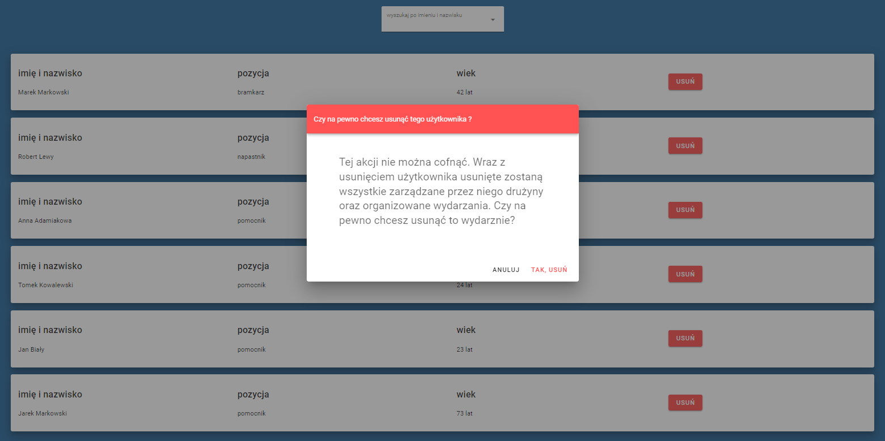
